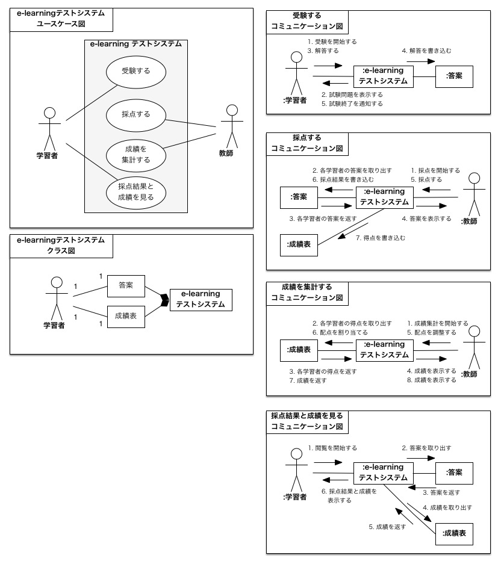

# ソフトウェア設計・同演習

この授業ではオブジェクト指向ソフトウェア開発の基礎をモデリング／プログラミング両面から学習します。旧科目のソフトウェア設計論／オブジェクト指向プログラミング演習から長年取り組んできた授業実践の研究成果を投入しています。

ソフトウェア開発スキルは個人差がとても大きく，従来の一斉講義・演習形式では学習進度を学生一人ひとりに適切に合わせることが不可能でした。そこで，学生が自分のペースで授業を進められるようにすべく，2015年度から**個別化教授システム(PSI: personalized system of instruction)**を採用して全面的にリニューアルしました。これにより[**完全習得学習(mastery learning)**](https://zacky1972.github.io/blog/2015/05/07/mastery-learning.html)の理想状態にすることを目指しています。

> 関連記事: [落ちこぼれをなくす！〜完全習得学習](https://zacky1972.github.io/blog/2015/05/07/mastery-learning.html)

もう1つの特徴は，研究室に所属する先輩学生であるティーチング・アシスタントが個別にモデルやプログラムをレビュー指導することです。モデリングやプログラミングの能力を向上させる最も効果的な方法はレビューだと私は考えています。そこで，研究室のプログラマ志望の学生をプロフェッショナルのエンジニアの協力を得ながら徹底的に鍛え，その学生をティーチング・アシスタントとして採用し**きめ細やかなレビュー指導**をするようにしました。また毎回の授業の終了後にふりかえりを行い，指導レベルの向上と均質化を図っています。これにより，実践的な個別指導を行き渡らせることを目指しています。

さらに，モデリングの学習のために **kintone ベースの個別学習管理システム**を[株式会社 AISIC](http://aisic.jp) と共同開発しました。これにより前述の個別化教授システムとレビュー指導を効果的・効率的に実現することを目指しています。ITシステムの新規開発には長い期間と巨額の費用がかかるものですが，kintone の採用により，驚くほどの短期間でかつ安価に開発できます。

## この授業のねらい

みなさんが「アプリ」という言葉を耳にした時に，たとえば Office，ウェブブラウザなどを連想するかもしれません。携帯のiアプリや，iPhone や Android などのスマートフォンで動作するアプリをイメージした人もいるかもしれません。このようなアプリを **GUI アプリケーション**と言います。この授業では，GUI アプリケーションのようなソフトウェアの実践的な開発方法(**オブジェクト指向開発**)を学びます。

とくに次のような人は全力でこの授業の修得に励んでください。

1. 将来，ソフトウェア開発の仕事に携わりたい人
2. 大学院に進学してソフトウェア工学を学びたい人

単なる座学ではなく，身の回りの製品やサービスをUMLで記述するような演習課題をたくさん行ったり，実際にソフトウェアを開発してコードレビューなどの個別指導を受けたりします。学生が行う作業量は多いですが，その分，実践的なソフトウェア開発の能力を身につけることができます。教え方をいろいろ工夫していますので，確実に，しかも楽しく学べるでしょう。

### 授業の前半について

授業の前半では，オブジェクト指向開発で用いられる設計記法，UML (Unified Modeling Language)によるソフトウェアモデリングの手法の基礎を学びます。UML は設計段階だけでなく，ソフトウェアライフサイクル全体にわたって使われます。最近のソフトウェア開発では，いきなりプログラミングするのではなく，UMLなどを使って分析したり設計したりすることから始めます。現在ではUMLはソフトウェア開発における「読み書き」の基礎能力だといってもいいでしょう。

UML によるソフトウェアモデルの実例を示しましょう。たとえば次の図は簡単な e-learning による試験を実施する IT システムの UML モデルを表しています。表記方法の詳細は分からないと思いますが，このシステム全体がどのようなものなのかが何となくつかめるのではないでしょうか。

この授業の到達目標に定められた合格基準をクリアすると，上図と同程度のUMLモデルを参考資料なしにスラスラと読んだり書いたりできるようになります。今までこの授業を履修して最後までがんばった学生のほとんどが，この合格基準をクリアできました。きっとみなさんも最後までがんばればできるようになるでしょう！

この授業で扱う UML を用いたソフトウェア・モデリングの考え方は，「ソフトウェア」と銘打ってはいますが，他の分野でも応用できます。たとえば力学シミュレーションや制御，ビジネス・プロセスなどの応用事例があります。

### 授業の後半について

授業の後半では，GUIアプリケーションを開発することを通して，オブジェクト指向開発を体験します。オブジェクト指向開発の中のプログラミングということで，とくに**オブジェクト指向プログラミング (Object-Oriented Programming: OOP)**と言います。

OOPとはどのようなものなのか，全容を理解することはなかなか難しいのですが，「GUIアプリケーションを作るためには，OOPを習得することが必須だ！」といえば，みなさんは少なくともOOPの必要性について充分理解できるでしょう。実際，みなさんがこの演習をすべて終えると，簡単なGUIアプリケーションが作れるようになれます。もちろんOOPなしでもGUIアプリケーションを作れないことはないですが，けっこう大変です。

オブジェクト指向プログラミングを学び，簡単なGUIアプリケーションが作れるようになろう！

#### OOPとGUI

OOP と **GUI (Graphical User Interface)** は歴史的に密接な関係にあります。

GUIでは，ウィンドウやアイコン，ボタンなどの **ウィジェット(Widget)** を，マウスやタッチパネルなどで直観的に操作します。1つ1つのウィジェットが，あたかも独立した部品のように振る舞います。

そこで，独立した部品同士がメッセージをやりとりする様子をそのままプログラミングできるようにすれば GUI アプリケーションをスマートにプログラミングできるのではないかと考えた人が現れました。そのような要求に適合したのが OOP です。 **OOP (Object-Oriented Programming) はオブジェクト(object)を単位としてプログラムを構成し，オブジェクト同士でメッセージを送受信し合うことで計算を行おうというパラダイム (paradigm: 考え方，ものの見方)です。** GUIでいうウィジェットをOOPでいうオブジェクトに当てはめて考えれば，OOPはGUIを実現するために理想的な考え方であることがわかってもらえると思います。

後に「パソコンの父」と呼ばれるアラン・ケイ (Alan Kay) が1973年に開発した Alto は，Smalltalk というオブジェクト指向プログラミング言語で開発されました。Altoは世界で最初の，マウスで操作するGUIを備えたコンピューター試作機でした。それを見て強烈な影響を受けたスティーブ・ジョブズ(Steve Jobs)が Macintosh を開発し，またビル・ゲイツ(Bill Gates)が Windows を開発することになります。Smalltalkはこれらには直接的に引き継がれませんでしたが，GUIを実現するためのオブジェクト指向プログラミング言語の開発が進み，C++, Objective-C, Java，C#などが誕生します。現在用いられるGUIはほぼすべて，OOPを前提として設計されています。

## 到達目標と成績評価

この授業の到達目標は全部で8つあります。成績評価は各到達目標に適した方法で行います。

1. **モデリングの概念:** モデリングに関連する概念を説明できる。
2. **UMLの基礎知識:** 代表的なモデリング手法であるUML(Unified Modeling Language)の図の種類や表記法を説明できる。
3. **UML読解:** 与えられた1〜5機能程度の簡単な製品やサービスについて書かれたUMLモデルを読み取って，自然言語で説明できる。
4. **UML記述:** 与えられた1〜5機能程度の簡単な製品やサービスについて自然言語で書かれた記述を元に UMLモデルを記述できる。
5. **UML図の不備の指摘:** 与えられた1〜5機能程度の簡単な製品やサービスについて書かれたUMLモデルの誤りや曖昧な点，不明な点を指摘できる。
6. **アプリ開発:** 簡単なGUIアプリケーションをオブジェクト指向，Model-View-Controller に基づいて開発できる。
7. **OOP:** 与えられたクラス図，アクティビティ図，状態機械図を元にJavaなどのオブジェクト指向言語でプログラミングできる。
8. **態度:** 世の中のあらゆる物をモデリングしようとする態度を身につける。

### 到達目標 1 モデリングの概念

***モデリングに関連する概念を説明できる。***

モデリングについて理解を深めるためには，モデリングに関連する言葉の意味がわかることが大事です。発展的な学習をスムーズにできるようになるためには，まず専門用語の意味が分かることが要件です。

概念の理解には段階があります。最初は言葉を丸暗記して復唱できるだけにとどまるかもしれませんが，学習を深めるにつれて意味を深く理解して自分の体験になぞらえて具体例を挙げながら自分の言葉で表現できるようになります。

この到達目標の最低要件は次の通りです。これらを全て満たせなければ合格できません。いずれも参考資料を参照しないでできることが求められます。

* 与えられた言葉の中からモデリングに関連が深いものを選べる
* モデリングに関連ある専門用語とその意味を正しく対応づけられる

さらに次の発展的要件ができれば，より深く理解していると判断します。これらは身の回りのものやウェブなどの参考資料を見て着想を得て構いません。

* オブジェクト，クラス，関連，汎化・継承，カプセル化，ポリモーフィズム，機能・構造・振舞い，ユースケース，ユースケースの包含，アクティビティ，相互作用，状態，パッケージについて，具体例を挙げながら適宜参考文献を引用して自分の言葉で説明できる

最低要件を満たしているか評価するために試験を実施します。試験は期末試験と授業中の小テストを含みます。また，発展的要件を満たしているか評価するためにレポートを課します。

### 到達目標 2 UMLの基礎知識

**代表的なモデリング手法であるUML(Unified Modeling Language)の図の種類や表記法を説明できる。**

モデリングできるための基礎として，UMLで扱う図や図中の記号について知らないとスムーズに読み書きすることがができません。

この到達目標の最低要件は次の通りです。これらを全て満たせなければ合格できません。

* よく使う7種類の図の名称を挙げられる
* 7種類の図を構造図と振舞い図に分類できる
* 7種類の図でよく用いられる記号と概念を正しく対応づけられる

さらに次の発展的要件ができれば，より深く理解していると判断します。

* 時々使う6種類の図の名称を挙げられる
* 6種類の図を構造図と振舞い図に分類できる
* 6種類の図で用いられる記号と概念を正しく対応づけられる
* よく使う7種類の図で時々用いられる記号と概念を正しく対応づけられる
* 与えられたUML図に対して，13種類の図のどれなのか正しく分類できる

最低要件と発展的要件を満たしているか評価するために試験を実施します。参考資料を参照しないでできることが求められます。

また，到達目標3,4,5,6の最終試験問題でも到達目標2の習得状況を評価します。

### 到達目標 3 UML読解

**与えられた1〜5機能程度の簡単な製品やサービスについて書かれたUMLモデルを読み取って，自然言語で説明できる。**

到達目標3,4,5はこの授業の最も主たる到達目標群です。このうち到達目標3はUML図を読むことができるかを問います。

この到達目標の最低要件は次の通りです。これらを全て満たせなければ合格できません。

* よく使う7種類のUML図それぞれについて，与えられたUML図を自然言語で説明できる

さらに次の発展的要件ができれば，より深く理解していると判断します。

* 与えられた1〜5機能程度の簡単な製品やサービスについて書かれたUMLモデルを読み取って，自然言語で説明できる

最低要件と発展的要件を満たしているか評価するために試験を実施します。参考資料を参照しないでできることが求められます。

### 到達目標 4 UML記述

**与えられた1〜5機能程度の簡単な製品やサービスについて自然言語で書かれた記述を元に UMLモデルを記述できる。**

到達目標4はUML図を書くことができるかを問います。

この到達目標の最低要件は次の通りです。これらを全て満たせなければ合格できません。

* よく使う7種類のUML図それぞれについて，与えられた自然言語の記述を元にUML図を記述できる

さらに次の発展的要件ができれば，より深く理解していると判断します。

* 与えられた1〜5機能程度の簡単な製品やサービスについて自然言語で書かれた記述を元に UMLモデルを記述できる

最低要件と発展的要件を満たしているか評価するために試験を実施します。参考資料を参照しないでできることが求められます。

### 到達目標 5 UML図の不備の指摘

**与えられた1〜5機能程度の簡単な製品やサービスについて書かれたUMLモデルの誤りや曖昧な点，不明な点を指摘できる。**

一度記述したUMLモデルには，もしかしたら問題点を含んでいるかもしれません。実際のソフトウェア開発では，1人が記述した成果物を必ず誰か他の人がレビューする(見直す)ことを行います。そうすることで，開発するソフトウェアをきちんと機能を果たす品質の高いものに改善していきます。

この到達目標は知識を総動員してUMLモデルをレビューすることを求めています。この到達目標の最低要件は次の通りです。これらを全て満たせなければ合格できません。

* 与えられた誤りを含むUML図の問題点を指摘できる

さらに次の発展的要件ができれば，より深く理解していると判断します。

* 与えられた1〜5機能程度の簡単な製品やサービスについて書かれたUMLモデルの問題点を指摘できる
* 指摘した問題点を修正するUMLモデルを提案できる

最低要件と発展的要件を満たしているか評価するために試験を実施します。参考資料を参照しないでできることが求められます。

### 到達目標 6 アプリ開発

**簡単なGUIアプリケーションをオブジェクト指向，Model-View-Controller に基づいて開発できる。**

UMLモデルを書くだけではソフトウェア開発は完結しません。UMLモデルを元にプログラミングする必要があります。到達目標6ではオブジェクト指向に基づいてGUIアプリケーションを開発できることを求めています。

この到達目標の最低要件は次の通りです。これらをすべて満たせなければ合格できません。

* 指定された要求仕様を満たす電卓を開発できる

さらに次の発展的要件ができれば，より深く理解していると判断します。

* 自由課題として電卓と機能数・工数が同程度以上のアプリケーションを開発できる

最低要件と発展的要件を満たしているか評価するためにプログラミングの演習課題を課します。本授業のテキスト，ウェブ上の資料を参照して構いません。また，Model-View-Controller アーキテクチャに沿って設計・実装されることと，教員・TAによるコードレビューをパスしていることを合格要件とします。

### 到達目標 7 OOP

**与えられたクラス図，アクティビティ図，状態機械図を元にJavaなどのオブジェクト指向言語でプログラミングできる。**

現在の技術ではUMLモデルをプログラミングするには人手が必要ですが，プログラムを自動生成する技術も考案されています。しかし，自動生成技術を駆使するためにも，UML モデルをどのようにプログラミングするかをきちんと理解する必要があります。

この到達目標はUMLモデルを元にプログラミングできることを求めています。この到達目標の最低要件は次の通りです。これらを全て満たせなければ合格できません。

* 与えられたクラス図，アクティビティ図，状態機械図を元にJavaなどのオブジェクト指向言語でプログラミングできる

最低要件を満たしているか評価するために演習課題を課します。PCを使い，与えられた参考資料を見ながらできることが求められます。

### 到達目標 8 態度

**世の中のあらゆる物をモデリングしようとする態度を身につける。**

モデリング能力を上達させるためには，日々の訓練が必要です。モデリングの題材は身の回りに広く転がっています。日常的な題材を日々モデリングし続けることで，モデリング能力の熟達に近づきます。

そこで最後の到達目標は，日々の態度を変えることを求めています。この到達目標を満たしているかを判断するのはとても難しいのですが，この授業で課される数々の提出物や積極的な授業への参加によって総合的に判断します。

## 教科書と参考書

### 教科書 

授業中に必要な資料を配布します。

### 参考書 (図書館蔵書には◯) 

* [◯牛尾 剛「オブジェクト脳のつくり方」翔泳社 ISBN: 978-4798104188](http://www.amazon.co.jp/gp/product/4798104183/ref=as_li_ss_tl?ie=UTF8&camp=247&creative=7399&creativeASIN=4798104183&linkCode=as2&tag=zacky1972-22)
* [◯平沢 章「オブジェクト指向でなぜつくるのか」(第2版) 日経BP社 ISBN: 978-4822284657](http://www.amazon.co.jp/gp/product/4822284654/ref=as_li_ss_tl?ie=UTF8&camp=247&creative=7399&creativeASIN=4822284654&linkCode=as2&tag=zacky1972-22)
* [◯E.ガンマ他 「デザインパターン」ソフトバンククリエイティブ，ISBN: 978-4797311129](http://www.amazon.co.jp/gp/product/4797311126/ref=as_li_ss_tl?ie=UTF8&camp=247&creative=7399&creativeASIN=4797311126&linkCode=as2&tag=zacky1972-22)
* [◯M.ファウラー 「リファクタリング」オーム社 ISBN: 978-4274050190 (新装版): 図書館蔵書は旧版](http://www.amazon.co.jp/gp/product/427405019X/ref=as_li_ss_tl?ie=UTF8&camp=247&creative=7399&creativeASIN=427405019X&linkCode=as2&tag=zacky1972-22)

## 授業計画・内容

本科目は大きくモデリングとプログラミングの2つに構成されています。全体的に学生が自分のペースで学習できるようにしています。学生のほとんどがモデリングの学習を終えた段階で，レビュー演習と中間試験を予定しています。

大まかに次のような順番で授業が進みますが，基本的に個別に学習するので，授業の回とは一致しません。また，それぞれの回の分量も一定ではありません。

1. オリエンテーション
2. モデリング
	1. モデリング概論
	2. クラス図(基本パターン，組み合わせパターン)
	3. ユースケース図(基本パターン，組み合わせパターン)
	4. コミュニケーション図／シーケンス図
	5. 状態機械図(基本パターン，組み合わせパターン)
	6. アクティビティ図
	7. パッケージ図
	8. 複数種類のUML図を用いたモデリング
	9. レビュー演習
	10. 中間試験
3. プログラミング
	1. プログラミング概論
	2. UMLモデルとプログラミング
	3. 電卓の開発
	4. 自由課題
4. ふりかえり

## 履修上の注意

* 身の回りにある製品やサービスを題材にモデリングを行うことが，前半のモデリングの中心的活動です。そのため，家電製品やウェブサービスなどに親しんでいると，この授業の役に立ちます。
* 何らかの設計図を見た経験があると理解の助けになるでしょう。
* C言語の文法を一通り理解していること，C言語で演習レベルの簡単な問題をプログラミングした経験があることが前提です。
具体的には次の項目を復習するといいでしょう。
	* 計算機演習I : 表示，キー入力，変数，条件分岐，配列，繰り返し，関数
	* 計算機演習II: ポインタ，構造体
	* アルゴリズム入門／データ構造とアルゴリズム・同演習: 配列，リンクリスト，2分木，スタック，キュー

## 担当者からのメッセージ

授業方法にこだわりさまざまな工夫をした結果，学生から「楽しかった！」「ためになった！」という声が多数寄せられました。私の授業を受講した先輩たちに感想を聞いてみてください。
