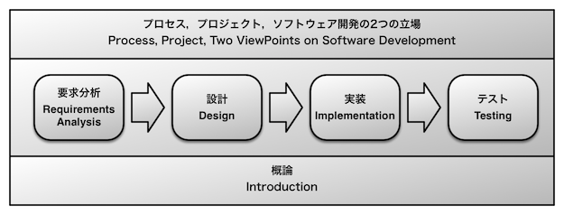

# Software Engineering

[in Japanese](/courses/SoftwareEngineering.html)

## Course Description

This class, Software Engineering instructs a body of knowledge of theories and practices on software development. Real software development includes not only programming but also various other activities. This class shows an overview how software is developed.

A graduate student should learn something actively, autonomously and deeply. This class is also designed to facilitate active, autonomous and deep learning in the learning process on software engineering. It is strongly needed to learn not only technology but also how to learn technology because a technology is evolved rapidly and becomes obsolescent. We believe your experience in this class will be useful for your future.

## Course Objectives

1. Given a topic related to software engineering, the student will generate a summary on the topic by writing in his/her own words, with supporting by the instructor and the text.

2. Given a topic related to software engineering, the student will generate research questions on the topic by writing in his/her own words.

3. The student will generate presentations and introductions for the research questions of Objective 2 with supporting by the instructor.

## Relationships to the Diploma Policy

I. Knowledge, Comprehension

* The student will generate a description of basic knowledge including concept and terminology related to software engineering, in his/her own words. (Objective 1&3)

II. Skills

* The student will adopt a systematic method to research on topics related to software engineering. (Objective 1&3)

III. Thinking, Decision Making, Writing

* The student will generate independently research questions (or problems) related to software engineering. (Objective 2)
* The student will adopt a suitable method to research on solutions of the problems. (Objective 1&3)
* The student will generate description on the solutions in his/her own words. (Objective 1&3)

IV. Interests, Motivation to Learn, Attitude

* The student will choose to raise and investigate research questions, based on his/her own interests and motivation to learn. (Objective 2&3)

## Textbooks

The textbook will be distributed in the class.

## References(Available in the library: ◯)

This section shows some major references. According to students’ interests, other references will be introduced to class.

◯[Software Engineering: A Practitioner’s Approach. Roger Pressman. McGraw-Hill.](//www.amazon.co.jp/gp/product/9814577383/ref=as_li_ss_tl?ie=UTF8&camp=247&creative=7399&creativeASIN=9814577383&linkCode=as2&tag=zacky1972-22)

◯[Software Engineering: Theory and Practice, Shari Lawrence Pfleeger, Pearson Education.](//www.amazon.co.jp/gp/product/0136061699/ref=as_li_ss_tl?ie=UTF8&camp=247&creative=7399&creativeASIN=0136061699&linkCode=as2&tag=zacky1972-22)

[SWBOK, IEEE Computer Society. available at http://www.computer.org/portal/web/swebok/home](http://www.computer.org/portal/web/swebok/home)

201 Principles of Software Development. Alan M. Davis. IEEE Computer Society.

[The Essence of Software Engineering: Applying the SEMAT Kernel. Ivar Jacobson et al. Addison-Wesley.](//www.amazon.co.jp/gp/product/0321885953/ref=as_li_ss_tl?ie=UTF8&camp=247&creative=7399&creativeASIN=0321885953&linkCode=as2&tag=zacky1972-22)

## Class schedules and Contents

We have designed this class to aim at facilitating active, autonomous and deep learning of students, who may have little experience to develop software.

This class consists of two parts.

### Contents of the textbook

1. Introduction
2. Programming
3. Design
4. Requirements Engineering
5. Software Testing
6. Process
7. Project
8. Two Viewpoints of Software Development
9. Service Design and Business

### Part I (Learning of the Overview)

1. Orientation
2. Reference 1
3. Reference 1 (discussion)
4. Reference 2
5. Reference 2 (discussion)
6. Reference 3
7. Reference 3 (discussion)
8. Reflection of Part I

### Part II (Poster Presentations)

8. Research Planning
9. Investigation
10. Writing Presentation
11. Poster Session
12. Reflection of Poster Session
13. Refining Presentation
14. Poster Session (Retry)
15. Reflection of Part II

## Assessment Method

* Objective 1, 30%
	* Three reports at least in Part I. Each describes a summary of the reference introduced in the textbook.
* Objective 2, 20%
	* Three reports at least in Part I. Each describes one or more research questions and their motivation.
* Objective 3, 50%
	*  A report. It describes a plan to research a research topic that is selected in the questions of Objective 2;
	* Twice poster presentations and the poster. They describe the investigation on the research question;
	* Twice reports. Each describes reflection of the discussion of each presentation;
	* A report. It describes reflection of this course; and
	* Class participation in discussion.

## Preparation and Review

In Part I, the student must read the books that will be lent from the instructor.

In Part II, the student must research and prepare a presentation.

## Remarks

* This class requires experience in software development (including programming) or project-based activity including graduation research. Contact the instructor before starting the term if the student does not have above-mentioned experience, to take supplementary lessons.
* This class requires presentation skills in Japanese. Contact the instructor before starting the term if the student does not have the skills.
* The student must prepare and review his/her lesson very much. However, the instructor will show how the learner should prepare and review his/her lesson at least, in the guidance and each lecture.

## Message from the Instructor

We have renewed this class in 2013, including adoption of the flipped classroom and active learning approach.

The flipped classroom means to swap the roles of a school lesson and homework: the role of the homework in the flipped style is to acquire knowledge and that of the lesson is to apply it by group works and follow-up instructions, though the role of the lesson in a traditional style is to acquire knowledge and that of the homework is to apply it. This approach aims to improve learning effectiveness.

Active leaning means that the students learn something by themselves, or instruction to intend such learning. In this course, the students raise research questions, research one of them, and make a presentation of it.

We adopt this approach with some arrangements in this class from our experiences based on our instructional design studies. The most important concept of this class design is to facilitate deep learning process started from a question of each student for software engineering topics. To strengthen it, the student will learn new knowledge by him/herself after finishing the whole course of study. Because software technology is evolved rapidly and becomes obsolescent, it is required not only to learn knowledge but also to learn how to learn knowledge.

## Keywords

Software engineering, software development, programming, software design, requirements engineering, software testing, software process model, software life cycle, software project planning, software project management.