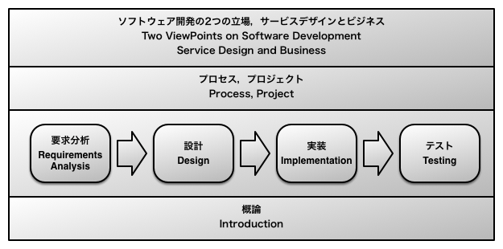

# ソフトウェア工学概論

## 授業の概要

ソフトウェア工学は，ソフトウェア開発の理論と実践の両面の知恵を結集した知識体系です。実際のソフトウェア開発ではプログラミングだけでなく様々な作業を行います。この授業では，ソフトウェア開発がどのように行われているかを概観します。

大学院生ともなれば，能動的・自律的に深く学べる能力を身につけることが欠かせません。この授業では，ソフトウェア工学を学ぶことを通して，能動的・自律的な深い学び方を習得します。技術は急速に進化するので知識は陳腐化して行く運命にありますが，だからこそ，技術ではなく技術の学び方を学ぶことが強く求められます。この経験は今後大いに役立つことでしょう。

## 関連記事

* [書籍刊行のお知らせ](/blog/2015/08/21/FD-book.html)
* [2015年度 ソフトウェア工学概論 公開ポスター発表会のお知らせ](/blog/2015/07/07/poster-presentation.html)
* [「ソフトウェア開発の教育のビジョンを語ろう」＠ソフトウェア科学会大会](/blog/2015/09/11/education-vision-JSSST-rePiT.html)
* [FD研修講演〜反転授業とアクティブラーニング](/blog/2015/12/02/FD-seminar-on-active-learning.html)
* [アクティブ・ラーニングの理想を実現せよ](/blog/2015/08/29/realize-the-ideal-of-active-learning.html)

## 到達目標

1. 与えられたソフトウェア工学関連トピックについて，教員と教科書の助けを得ながら，自分の言葉で要約を記述できる。

2. 与えられたソフトウェア工学関連トピックについて，自分の言葉でリサーチクエッションを記述できる。

3. 到達目標2のリサーチクエッションについて，教員の助けを得ながら，独自に調査してプレゼンテーションと解説記事を記述できる。

## 学位授与方針との関連

I. 知識・理解

* ソフトウェア工学関連の概念・用語等の基礎知識を自分の言葉で説明できる。(到達目標1,3)

II. 技能

* ソフトウェア工学関連トピックについて，体系立てた方法で調査できる。(到達目標1,3)

III. 思考・判断・表現

* ソフトウェア工学関連のリサーチクエッション(問題)を独自に立てられる。(到達目標2)
* 上記の問題の解決法について調査できる。(到達目標1,3)
* 上記の解決法について自分の言葉で表現できる。(到達目標1.3)

IV. 関心・意欲・態度

* 自らの関心・意欲に基づいて課題を設定し調査する態度を身につける。(到達目標2,3)

## 教科書

授業中に配布します。

## 参考書(図書館蔵書には◯)

主要な参考書を掲載します。学生の興味に応じて授業中にも紹介します。

◯[実践ソフトウェアエンジニアリング〜ソフトウェアプロフェッショナルのための基本知識 ロジャー・プレスマン著 西康晴ほか監訳 日科技連出版社](http://www.amazon.co.jp/gp/product/4817161485/ref=as_li_ss_tl?ie=UTF8&camp=247&creative=7399&creativeASIN=4817161485&linkCode=as2&tag=zacky1972-22)

◯[Software Engineering: A Practitioner’s Approach. Roger Pressman. McGraw-Hill.](http://www.amazon.co.jp/gp/product/9814577383/ref=as_li_ss_tl?ie=UTF8&camp=247&creative=7399&creativeASIN=9814577383&linkCode=as2&tag=zacky1972-22)

◯[ソフトウェア工学〜理論と実践 シャリ・ローレンス・プリーガー著 堀内泰輔訳 ピアソン・エデュケーション](http://www.amazon.co.jp/gp/product/4894713683/ref=as_li_ss_tl?ie=UTF8&camp=247&creative=7399&creativeASIN=4894713683&linkCode=as2&tag=zacky1972-22)

◯[Software Engineering: Theory and Practice, Shari Lawrence Pfleeger, Pearson Education.](http://www.amazon.co.jp/gp/product/0136061699/ref=as_li_ss_tl?ie=UTF8&camp=247&creative=7399&creativeASIN=0136061699&linkCode=as2&tag=zacky1972-22)

◯ソフトウェアエンジニアリング基礎知識体系-SWEBOK2004 松本吉弘訳 オーム社

[SWBOK, IEEE Computer Society. available at http://www.computer.org/portal/web/swebok/home](http://www.computer.org/portal/web/swebok/home)

◯ソフトウェア開発201の鉄則 アラン・デービス著 松原友夫訳 日経BP社
201 Principles of Software Development. Alan M. Davis. IEEE Computer Society.

The Essence of Software Engineering: Applying the SEMAT Kernel. Ivar Jacobson et al. Addison-Wesley.

## 授業計画・内容

私たちは，ソフトウェア開発経験の浅い学生の能動的・自律的な深い学びを促進することを狙って，この授業を設計しました。

授業は2部構成です。

教科書の内容

1. 概論
2. プログラミング
3. 設計
4. 要求開発
5. ソフトウェアテスト
6. プロセス
7. プロジェクト
8. ソフトウェア開発の2つの立場

Part I (概要の学習)

1. オリエンテーション
2. 参考書 1
3. 参考書 1 (ディスカッション)
4. 参考書 2
5. 参考書 2 (ディスカッション)
6. 参考書 3
7. 参考書 3 (ディスカッション)
8. Part I ふりかえり

Part II (ポスター発表)

9. 研究計画
10. 調査
11. プレゼンテーション作成
12. ポスター発表
13. プレゼンテーション洗練
14. ポスター発表(再)
15. Part II ふりかえり

## 成績評価の方法

到達目標ごとの成績評価

* 到達目標1: 教科書で紹介する参考書の中から3冊以上の要約を記述したレポート(Part I): 30%
* 到達目標2: 3個以上のリサーチクエッションとその動機を記述したレポート(Part I): 20%
* 到達目標3: 下記の合計: 50%
	* リサーチクエッションの研究計画のレポートとディスカッション(1回)
	* リサーチクエッションについて調査したポスター発表(2回発表，1回成果物提出)
	* ポスター発表での議論をふりかえったレポート(2回)
	* 授業全体をふりかえったレポート(1回)
	* 授業への積極的参加

## 履修上の注意

* プログラミングなどのソフトウェア開発をした経験があるか，卒業研究などのプロジェクト活動を行った経験があることを前提としています。どちらも経験ない場合には補習をしますので，学期が始まる前に担当教員に相談してください。
* 授業中に日本語によるプレゼンテーションを行います。必要な日本語能力がない場合には，学期が始まる前に担当教員に相談してください。
* 学生は授業時間中の学習だけでなく予習・復習を多く行う必要があります。ただし，最低限どのような予習・復習をすべきかについては，教員がオリエンテーションならびに授業中に明示します。

## 担当者からのメッセージ

この授業では2013年度に「反転授業」と「アクティブラーニング」という新しい授業スタイルを取り入れる，大きなリニューアルをしました。

反転授業でいう「反転」は，授業と課外学習の役割を反転させることを指します。普通の授業では，授業時間中に知識を吸収し，課外学習で応用問題の宿題を行います。しかし，反転授業では，知識吸収を自習教材で予習時間中に済ませてしまいます。代わりに教員と学生が一堂に会する授業時間を有効活用して，応用問題を扱うグループワークや質問に対するフォローアップなどを行います。こうすることで，さらなる授業の学習効果の向上を狙っています。

アクティブラーニングは，学生が主体的・能動的に学習すること，またそのような学習を意図した授業スタイルです。この授業では学生がリサーチクエッションを発問し自分で調査して発表するという形でアクティブラーニングにしています。

この授業では，担当教員の長年のソフトウェア工学の教育実践研究の成果を踏まえ，反転授業とアクティブラーニングを独自にアレンジして取り入れています。この授業の設計にあたってもっとも重要な点は，くり返しになりますが，ソフトウェア工学に対する学生の自発的な問いに沿った深い学びのプロセスを促進することです。これを強化することで学生が卒業した後も自分の力で新たな知識を習得できることを狙っています。ソフトウェア分野は技術の多くが急速に陳腐化してしまうので，たんに知識を習得できるだけでは不十分です。知識の習得のしかたそのものを学ぶ必要があるのです。

